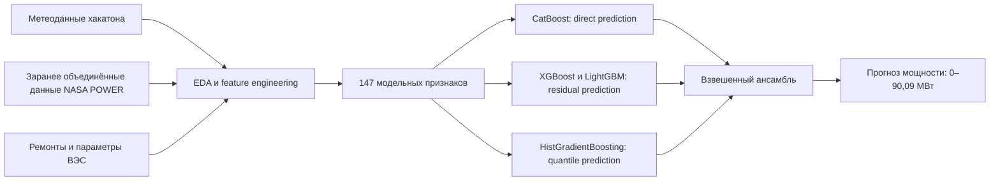

# Прогнозирование выработки ветроэлектростанции

Портфолио-версия решения команды **«НаН»** для хакатона по прогнозированию почасовой выработки ветроэлектростанции установленной мощностью 90,09 МВт.

Проект показывает ML-пайплайн: исследование данных, физически обоснованный feature engineering, работа с несколькими источников метеоданных и ансамбль моделей градиентного бустинга.

## Задача

По прогнозу погоды, техническому состоянию станции и временному контексту требуется оценить почасовую выработку ВЭС.

Погрешность одного прогноза определяется как:

$$
\text{error}_t =
\frac{|G_{a,t} - G_{f,t}|}{N_{\text{уст}}}
\cdot 100\%,
$$

где:

- $G_{a,t}$ - фактическая выработка в час $t$;
- $G_{f,t}$ - прогноз модели;
- $N_{\text{уст}} = 90{,}09$ МВт - установленная мощность станции.

Итоговая погрешность периода - среднее значение почасовой ошибки.

## Результаты хакатона

Организаторы оценивали точность по двум закрытым периодам: первому кварталу 2026 года и 18 мая 2026 года. Их оценки взвешивались с коэффициентами 90% и 10%.

| Период | Погрешность команды «НаН» | Балл |
|---|---:|---:|
| 1 квартал 2026 | 7,4% | 8,8 |
| 18.05.2026 | 3,6% | 8,5 |
| Взвешенная оценка точности | - | 8,8 |

В таблице точности команда находилась в топе, однако не вошла в итоговую таблицу оценки качества моделей: организаторам не удалось подтвердить воспроизводимость результата.

Причина - в переданном на проверку пакете отсутствовал шаг получения и объединения данных **NASA POWER**. Эти признаки использовались финальной моделью и дали улучшение качества, но готовые объединённые датасеты нельзя было восстановить только из переданного кода. Воспроизводимость была отмечена значением `0`.

В текущем репозитории это ограничение зафиксировано явно: проект не изображает полностью воспроизводимый результат там, где для него отсутствует исходный разрешённый источник данных.

Локальная проверка упрощённого direct ensemble на доступной размеченной части периода с 1 апреля по 17 мая дала погрешность **7,9979%**. Эта оценка не сравнивается напрямую с официальными 7,4% и 3,6%, поскольку рассчитана на другом временном интервале.

## Данные и ограничения распространения

**Исходные данные хакатона нельзя распространять.** Они не должны публиковаться в репозитории, пересылаться третьим лицам или использоваться вне условий, установленных организаторами.

Также в публичную версию не входят:

- исходные `train`, `valid` и `test`;
- датасеты, объединённые с NASA POWER;
- подготовленные таблицы признаков;
- фактические значения скрытых периодов;

Для запуска проекта пользователь должен самостоятельно разместить полученные законным способом файлы в ожидаемой структуре:

```text
data/
├── map/
│   └── wind_farm_coords.csv
├── train/
│   └── train_merged.csv
├── valid/
│   └── valid_merged.csv
└── test/
    └── test_merged.csv
```

Скрипт выгрузки NASA POWER в репозиторий не включён. Ноутбук ожидает уже объединённые файлы с необходимыми метеорологическими колонками.

## Архитектура решения



### Feature engineering

В проекте реализованы:

- циклические признаки часа, месяца и дня года;
- скорость ветра на нескольких высотах и её квадраты и кубы;
- вертикальный wind shear;
- синус и косинус направления ветра;
- плотность воздуха и скорректированная скорость ветра;
- плотность мощности ветрового потока;
- теоретические и эмпирические кривые мощности;
- доступная мощность с учётом ремонта турбин;
- сглаженные погодные сигналы и временные сдвиги NWP;
- расхождения между основным метеоисточником и NASA POWER;
- анализ геометрии станции, кластеров турбин и wake-risk.

В EDA отдельно выводятся 20 признаков с наибольшей абсолютной корреляцией с target. После обучения рассчитывается агрегированная важность признаков для моделей, предоставляющих `feature_importances_`.

### Ансамбль

Финальный прогноз объединяет шесть моделей:

| Модель | Цель |
|---|---|
| CatBoost MAE | прямая выработка |
| XGBoost | отклонение от эмпирической кривой мощности |
| LightGBM | отклонение от эмпирической кривой мощности |
| HistGradientBoosting q=0.545 | нормированная выработка |
| HistGradientBoosting q=0.570 | нормированная выработка |
| HistGradientBoosting q=0.530 | нормированная выработка |

Веса ансамбля были зафиксированы по результатам предыдущего подбора гиперпараметров. Прогноз каждой ветки и итоговый прогноз ограничиваются физическим диапазоном от 0 до 90,09 МВт.

## Структура проекта

```text
notebooks/
├── notebook_eda.ipynb
└── notebook_train_model.ipynb
```

`notebook_eda.ipynb`:

- загружает и синхронизирует данные;
- приводит временные метки к часовому шагу;
- строит физические и временные признаки;
- анализирует погодные источники и кривые мощности;
- формирует модельные датасеты.

`notebook_train_model.ipynb`:

- загружает подготовленные признаки;
- обучает шесть моделей с прогресс-баром;
- показывает важность признаков;
- формирует взвешенный прогноз ансамбля;
- считает локальную погрешность.

## Запуск

Проект разрабатывался на Python 3.12.

```bash
pip install numpy pandas scipy scikit-learn catboost xgboost lightgbm matplotlib seaborn tqdm jupyter
```

Ноутбуки выполняются последовательно:

1. `notebooks/notebook_eda.ipynb`
2. `notebooks/notebook_train_model.ipynb`

EDA сохраняет подготовленные таблицы в `outputs/datasets`. Обучающий ноутбук читает их оттуда, поэтому запуск второй части без первой не предполагается.

## Что демонстрирует проект

- работу с временными и метеорологическими данными;
- применение физики предметной области в feature engineering;
- построение direct-, residual- и quantile-веток;
- объединение CatBoost, XGBoost, LightGBM и HistGradientBoosting;
- контроль физически допустимого диапазона прогноза;
- разделение официальной закрытой оценки и локальной проверки;
- честное описание ограничений воспроизводимости и доступа к данным.

Проект является очищенной портфолио-версией хакатонного решения.
